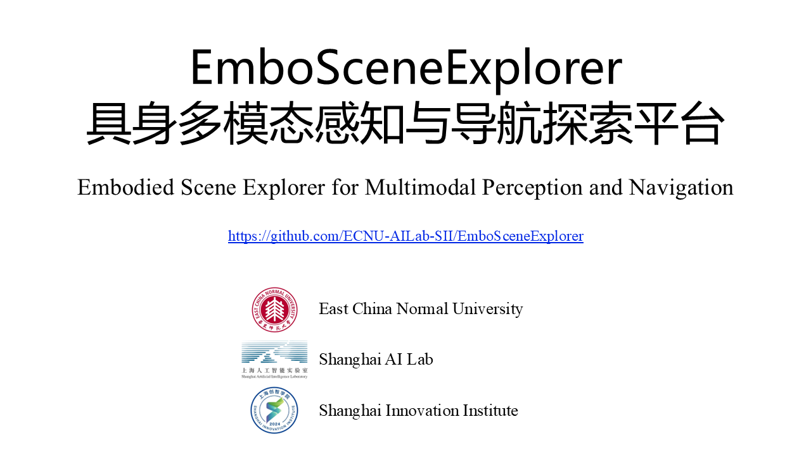

# EmboSceneExplorer: Embodied 3D Scene Perception and Navigation System

## 🔥 News
- [2025-7-22] Version 1.0 released! 🎉

## Table of Contents

1. [What is EmboSceneExplorer?](#what-is-EmboSceneExplorer)
2. [Key Features](#key-features)
3. [Quick Start](#quick-start)
4. [Support](#support)
5. [License and Acknowledgments](#license-and-acknowledgments)
6. [Citation](#citation)

## What is EmboSceneExplorer?

**EmboSceneExplorer** is an end-to-end scene understanding and autonomous navigation system built on the Habitat simulation environment. It enables robots and embodied AI agents to perform intelligent perception, semantic reconstruction, and goal-oriented exploration in complex 3D environments through multimodal data fusion. The workflow comprises four core components:

1. **Multimodal Data Collection and Reconstruction**  
   Dynamically captures RGB/RGB-D image sequences, depth maps, and semantic maps with COLMAP-style camera poses.

2. **Scene Reconstruction & Understanding**  
   Generates comprehensive scene representations including:  
   - High-fidelity meshes  
   - Dense point clouds  
   - Occupancy grid maps (Occ)

3. **3D Visual Grounding**  
   Bridges language and spatial understanding by:  
   - Parsing natural language instructions into actionable goals  
   - Grounding semantic concepts to 3D locations  
   - Generating pixel-accurate object masks from textual queries

4. **Autonomous Navigation**  
   Integrates scene representations (3DGS/Mesh/Occ) to:  
   - Build navigable topological maps  
   - Plan optimal collision-free paths  
   - Execute exploration and goal-reaching behaviors

**Note**: The current release includes the core simulation environment with data collection, reconstruction, and navigation modules. Our 3D visual grounding subsystem is under active development and will be expanded in future updates. Advanced features including language-conditioned exploration will be rolled out progressively.

EmboSceneExplorer aims to:

- **Enable closed-loop simulation** from data acquisition → reconstruction → semantic grounding → navigation
- **Automate embodied data collection** for scalable training of physical AI agents
- **Unify 3D representations** across perception, reconstruction, and navigation tasks

Project Page: <https://EmboSceneExplorer-embodied-ai.github.io/>

## Key Features

- **Multimodal Sensor Fusion**: Synchronizes vision (RGB-D), geometry (point clouds), and semantics (textual instructions)
- **Dynamic Scene Modeling**: 
  - High-fidelity rendering via 3D Gaussian Splatting
  - Real-time spatial reasoning with occupancy grids
- **Language-Driven Exploration**: 
  - Grounds open-ended instructions (e.g., "Find the desk behind the blue door")
  - Supports zero-shot navigation to novel objects
- **Modular Architecture**: 
  - Interchangeable reconstruction backends (3DGS/Mesh/Occ)
  - Habitat-compatible navigation API

## Quick Start

### Prerequisites
- **Miniconda/Anaconda** (latest version)
- **NVIDIA GPU** (recommended for full performance)
- **Linux** (Ubuntu 20.04/22.04 recommended)

### Cloning the Repository
```bash
# HTTPS
git clone --recursive https://github.com/ECNU-AILab-SII/EmboSceneExplorer.git

or

# SSH
git clone --recursive git@github.com:ECNU-AILab-SII/EmboSceneExplorer.git
```

### Conda Environment Setup
```bash
# Create environment from provided YAML
conda env create -f environment.yml

# Activate environment
conda activate emboscene
```

### Data Preparation
```bash
# Download sample scenes:
gdown https://drive.google.com/file/d/1jwboFEruYFIG9c31qWga6X-vgbraKIt-/view?usp=sharing
unzip scenes.zip -d example_data/
cp example_data/scanet/pointnav_scannet.yaml ./submodules/habitat-lab/habitat-lab/habitat/config/benchmark/nav/pointnav
# Modify the root_path in example_data/scanet/scannet.yaml to the project's absolute path.
cp example_data/scanet/scannet.yaml ./submodules/habitat-lab/habitat-lab/habitat/config/habitat/dataset/pointnav/
```

### Start
```bash
cd bash scripts

# 1. Data collection:
bash data_collection.sh

# 2. RGB-D Reconstruction:
bash reconstruction.sh

# 3. Occupancy map reconstruction:
bash occupancy.sh

# 4. Visual grounding:
bash visual_grounding.sh

# 5. Navigation:
bash navigation.sh
```

## Support

- Report bugs or request features via GitHub [Issues](https://github.com/ECNU-AILab-SII/EmboSceneExplorer/issues).
- Join discussions or ask questions on GitHub [Discussions](https://github.com/ECNU-AILab-SII/EmboSceneExplorer/discussions).

## License and Acknowledgments

The EmboSceneExplorer source code is licensed under Apache 2.0.

EmboSceneExplorer's development has been made possible thanks to these open-source projects:

- [Habitat-sim](https://github.com/facebookresearch/habitat-sim.git): High-performance cross-platform compute backend. Kudos to the Taichi team for their technical support!
- [Habitat-lab](https://github.com/facebookresearch/habitat-lab): Reference MPM solver implementation.

## Citation

If you use EmboSceneExplorer in your research, please consider citing:

```bibtex
@misc{EmboSceneExplorer,
  author = {EmboSceneExplorer Authors},
  title = {EmboSceneExplorer: An Universal Robotics Simulation platform based on habitat-sim},
  month = {December},
  year = {2025},
  url = {https://github.com/ECNU-AILab-SII/EmboSceneExplorer/}
}
